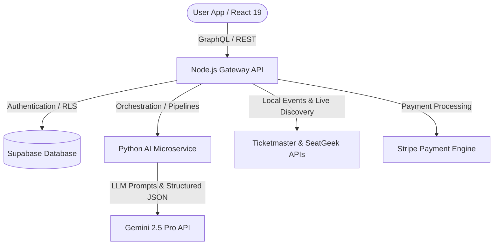
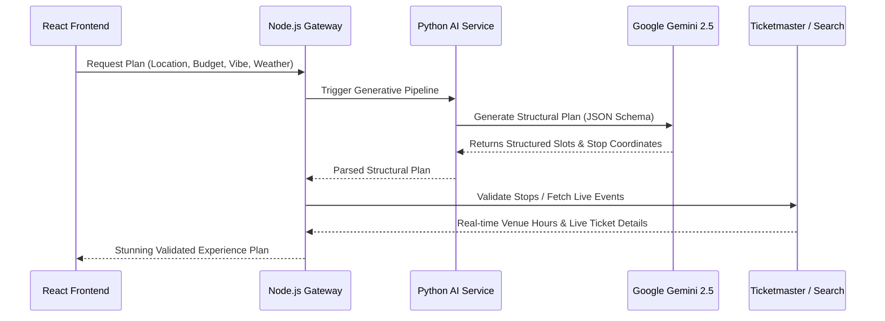

# Building DateSpark: How We Engineered an AI-Powered Social Discovery Platform for Couples

*Author: Erold Rayan*  
*Category: Software Engineering, AI & Product Design*  
*Read Time: ~8 mins*

---

In an era dominated by doom-scrolling and digital fatigue, social platforms often succeed by keeping users glued to their screens. But what if we built a platform designed specifically to **get people off their screens and into the real world**?

Enter **DateSpark**—a premium, state-of-the-art social discovery platform that leverages advanced artificial intelligence and live event APIs to orchestrate personalized real-life couple experiences. 

Here is an in-depth breakdown of how we architected, built, and optimized DateSpark from the ground up.

---

## 🗺️ The Architecture at a Glance

DateSpark is built on a high-performance, containerized microservices architecture. It separates frontend visual performance from backend data intensive operations and AI orchestration.



### The Technology Stack
1. **Core Frontend:** React 19, Vite (for lighting-fast local hot reloading and optimized assets compilation), Framer Motion (for premium micro-animations and sleek card transitions), and Lucide-React icons.
2. **Gateway API Backend:** Node.js/Express handling secure sessions, payment processing, proxying, and caching.
3. **AI Logic Engine:** Python/FastAPI microservice handling high-density prompts, vector embeddings, and structured JSON parsing.
4. **Cloud Database & Auth:** Supabase PostgreSQL with Real-time synchronization and Row-Level Security (RLS) policies.
5. **Third-Party Integrations:** Google Gemini 2.5 Pro, Stripe (Live Mode), Ticketmaster Discovery API, and SeatGeek Client API.

---

## ⚡ The Double-Pass AI Pipeline

One of the biggest challenges in building an AI date planner is **accuracy**. If an AI hallucinates a venue that closed in 2021 or suggests an outdoor picnic during a rainstorm, user trust is destroyed.

To solve this, we engineered a bulletproof **Double-Pass AI Pipeline** that couples the generative intelligence of Gemini with real-world validation APIs.



### Phase 1: Structural Generation (The AI Pass)
Instead of asking the LLM to write a generic text description, we enforce a strict JSON schema. The AI acts as a logistical scheduler, determining:
* The optimal sequence of events (e.g., matching cozy morning coffee places to romantic sunset dinner viewpoints).
* Precise coordinate vectors for geographic constraints.
* Logical transition steps (e.g., injecting a customized **"Walk Time Connector"** between two stops).

### Phase 2: Live Enrichment (The API Pass)
Once the structure is generated, our Node.js Gateway intercepts it and queries real-world location and event discovery engines. We verify:
* **Operating Hours:** Ensuring the venue is actually open.
* **Live Events:** Pulling live performance tickets from Ticketmaster or SeatGeek if a couple wants to see a local show.
* **Atmospherics ("Vibe Tags"):** Attaching modern context filters such as `Cozy`, `Hidden Gem`, or `Highly Rated` to give immediate visual feedback.

---

## 🎨 Premium Design System & Micro-Animations

We wanted DateSpark's first impression to be absolutely breathtaking. We rejected default styling and standard Tailwind configurations to craft a custom **dark-mode-first glassmorphic system**.

### Key Interface Innovations:
* **The "Visual Spark Card":** A high-performance card component that displays immersive, high-quality images of the target venues, weather forecasts, and customized route navigation overlays in real-time.
* **Atmospheric Spark Chat:** An interactive conversational chat window equipped with customized typing prompts, which lets users easily guide the AI to regenerate or swap specific schedule stops on the fly.
* **Responsive BottomNav:** An HSL-tailored floating menu that feels premium and responsive on both native mobile screen widths and desktop layouts.

Here is an example of the clean, motion-enhanced UI structure used for key transitions:

```javascript
// A snippet showcasing our high-fidelity, interactive Framer Motion wrapper
import { motion, AnimatePresence } from 'framer-motion';

export const FadeInUp = ({ children, delay = 0 }) => (
    <motion.div
        initial={{ opacity: 0, y: 20 }}
        animate={{ opacity: 1, y: 0 }}
        exit={{ opacity: 0, y: -20 }}
        transition={{ duration: 0.5, ease: [0.16, 1, 0.3, 1], delay }}
    >
        {children}
    </motion.div>
);
```

---

## 🛠️ Overcoming Core Engineering Challenges

### 1. The "UUID UUID" Database Gotcha
When building high-speed client interactions with Supabase, executing queries directly from the client can occasionally lead to unexpected 400 Bad Request responses (such as client-side library type-mismatches). 
* **The Fix:** We built a robust proxy layer in the Node.js Express server. By utilizing a secure service role client on the backend, the client forwards request signatures and queries standard databases safely, neutralizing client-side UUID issues entirely.

### 2. Live Stripe Mode Integration
We integrated Stripe's checkout system to allow immediate conversion from regular accounts to **Elite Premium Memberships**.
* **The Fix:** We utilized a secure webhook listener (`/api/webhook`) that safely parses raw request buffers to verify cryptographical Stripe signatures. Once Stripe clears a transaction, a secure update immediately adjusts the user profile's `is_premium` flag and `premium_expiry` date in real time.

---

## 📈 What We Learned

Building DateSpark taught us valuable lessons about building production ready AI applications:
1. **User Control is Critical:** Users do not want the AI to make every decision. They want the capability to accept, decline, swap, or re-prompt specific choices within an itinerary before committing to it.
2. **Speed & Caching:** AI generation can take a few seconds. We implemented aggressive, localized server-side caching (`node-cache`) for trending itineraries and static location results to maintain sub-second load times for hot-path user actions.

---

## 🚀 Try It Today!

DateSpark is now live and fully operational on the cloud!

* **Explore the Platform:** [datespark.live](https://datespark.live)
* **Under the Hood:** Log in with your profile to configure personal preferences, discover local hotspots, and access tailored schedules.

*Let me know what you think of this architecture in the comments below!*
