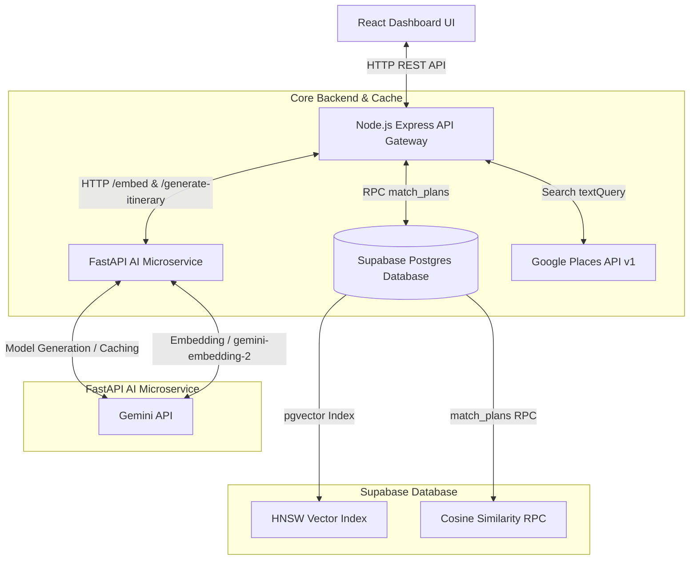

# DateSpark System Design & Architecture Specification

This document details the production architecture, data pipelines, and design decisions that govern DateSpark. The system is engineered to provide premium, real-world grounded, hyper-personalized date itineraries while keeping operational costs and latency minimal.

---

## 1. System Architecture Overview

DateSpark is built on a decoupled, three-tier service-oriented architecture:
1. **Frontend (React Dashboard UI)**: Presents a responsive user interface for itinerary creation, semantic plan discovery, and profile management.
2. **API Gateway (Node.js Express)**: Acts as the secure orchestrator, managing session authentication, payment flows, third-party vendor integrations (Google Places, Ticketmaster, SeatGeek, Stripe), and proxying requests.
3. **AI Microservice (FastAPI / Python)**: Handles high-density natural language processing, vector embedding generation, and LLM orchestration.
4. **Database Layer (Supabase / PostgreSQL)**: Stores plan data, transaction logs, and performs low-latency vector similarity searching.

---

## 2. Core Architectural Components

### A. Frontend (React Dashboard UI)
Commits client-side state, queries the API Gateway, and renders interactive maps. It uses clean CSS/JS constructs, preventing heavy framework bloating and enabling lightning-fast loads.

### B. API Gateway (Node.js / Express)
*   **Orchestration**: Manages complex asynchronous user actions (e.g., plan generation, payment validation via Stripe, trending list updates).
*   **Enrichment (The Semantic Bridge)**: Rather than relying on the LLM to know real-world places, the gateway intercepts the LLM's high-intent search query coordinates and matches them live against Google Places API for real-time validation and rich asset tagging (photos, reviews, booking links).
*   **Fail-safe fallback**: Automatically handles API exhaustion by routing search queries through alternative search heuristics.

### C. AI Microservice (FastAPI / Python)
*   **Gemini Integration**: Built natively with the new `google-genai` Python SDK.
*   **Vector Embeddings**: Exposes `/embed` and `/embed/bulk` endpoints powered by `gemini-embedding-2`.
*   **Context Caching**: Boosts generation speeds by caching system prompts and extensive few-shot examples on model start.

### D. Database Layer (Supabase / Postgres)
*   **pgvector & HNSW**: Leverages Postgres' native `pgvector` extension. The HNSW index allows cosine similarity searches inside the `plans` table in milliseconds.
*   **Postgres RPC**: Performs vectorized search execution natively using PostgreSQL database functions, preventing overhead from extra network roundtrips.

---

## 3. Engineering Decisions & Design Trade-Offs

### A. Two-Stage RAG (Retrieval-Augmented Generation) & Semantic Enrichment
One of the most critical design decisions in DateSpark was separating **Itinerary Ideation** from **Venue Validation**. 

#### The Problem: Hallucinations and Cost
If the LLM is asked to output actual venues with correct coordinates, phone numbers, and addresses, it suffers from two major failures:
1.  **Hallucination**: The LLM will invent restaurants, bars, and scenic spots that do not exist, leading to a terrible user experience.
2.  **Prompt Inflation & Fine-Tuning Costs**: Forcing the LLM to memorize local maps requires massive prompt context or expensive fine-tuning.

#### The Solution: The Two-Stage Pipeline
1.  **Stage 1 (Ideation)**: The FastAPI service generates a coordinate-less draft plan with categories (e.g. "Speakeasy Cocktails"), a high-intent Google Maps search query (e.g., `"Chic speakeasy bar in West Village, NYC"`), and placeholder venue tags (`"REAL PLACE TBD"`).
2.  **Stage 2 (Enrichment)**: The Node.js gateway takes these queries and passes them to the **Google Places API** biased by the user's current GPS location. Google returns the actual, verified venue, complete with its official rating, formatted address, real latitude/longitude, reviews, and a photo.

*Why this is superior*: It yields **100% accurate, real-world venues** while keeping the LLM generation prompt small, structured, and extremely cheap to process.

---

### B. LLM Cost Optimization: Gemini Context Caching
DateSpark prompts are rich in context, using 5 detailed, multi-step few-shot examples of itineraries to ensure the model responds with perfectly formatted JSON. These examples, combined with the detailed Concierge instructions, total over 2,200 tokens.

*   **Standard Prompting**: Ingesting 2,200 tokens on every single generation is highly repetitive and scales costs linearly.
*   **Context Caching**: By utilizing Gemini Context Caching (`client.caches.create`), we upload the system instructions and few-shot examples once per hour. When a user requests an itinerary, the model is queried with *only the dynamic prompt (vibe, budget, city, location)*. 
*   **Result**: Reduces input token costs by **up to 75%** and cuts model response latency (Time to First Token) in half because the base prompt does not need to be re-evaluated.

---

### C. Database Vector Strategy: Supabase pgvector vs. Dedicated Vector DBs
We chose to utilize `pgvector` inside Supabase rather than a standalone vector database (like Pinecone or Milvus):

| Metric | Supabase pgvector (Selected) | Dedicated Vector DB |
| :--- | :--- | :--- |
| **Data Consistency** | **ACID Compliant** (Same database, single transaction) | Eventual Consistency (Sync delay between DB and Vector DB) |
| **Query Latency** | **Zero Network Hop** (Filter and match in Postgres) | Network Hop Latency (Fetch from DB, Query Vector DB, Join) |
| **Operational Overhead** | **None** (Managed inside existing Supabase) | High (Requires managing two different databases) |
| **Hybrid Filtering** | **Easy** (Regular SQL joins & `WHERE` clauses) | Complex (Requires metadata syncing and filtering index limits) |

*Why this is superior*: DateSpark's semantic search requires filtering by location (`location ILIKE ...`) and lifecycle state (`deleted_at IS NULL`) before matching. Performing this hybrid query inside a single Postgres transaction using the `match_plans` RPC is significantly faster and cleaner.

---

### D. Search Resiliency: Hybrid Vector + Keyword Search
Our search engine employs a hybrid strategy with auto-fallback:
1.  **Semantic Search (Primary)**: Generates an embedding for the query using `/embed` (FastAPI) and requests matching vector entries from the DB using `match_plans`.
2.  **Keyword Search (Secondary/Fallback)**: If the FastAPI service is down or if the database RPC throws an error, the system automatically falls back to an SQL keyword match (`ILIKES` across the title, description, and vibe tags).

*Why this is superior*: It guarantees high system availability. Even if third-party APIs or python workers go offline, the search bar will continue to function seamlessly.

---

## 4. Vector Data Model Alignment

### Matryoshka Representation Learning (MRL) Truncation
Gemini's `gemini-embedding-2` model outputs vectors with a default dimensionality of `3,072`. While high-dimensional vectors offer rich semantic granularity, storing them in database indexes creates substantial memory overhead.

To resolve this, we leverage **MRL (Matryoshka Representation Learning)** supported by the Gemini API. We specify `output_dimensionality: 768` in our [EmbedContentConfig](file:///c:/Users/Erold%20Rayan/Downloads/Million%20Dollar%20Web%20app%20Ideas/Date%20Planner%20app/backend/ai_service/main.py#L413) call.
*   The model truncates the vector to 768 dimensions with minimal semantic loss.
*   This matches our database column type `vector(768)` (defined in [enable-vector-search.sql](file:///c:/Users/Erold%20Rayan/Downloads/Million%20Dollar%20Web%20app%20Ideas/Date%20Planner%20app/scripts/enable-vector-search.sql#L13)).
*   It reduces database index size and comparison latency by **75%** compared to using the default 3072-dimensional vector.
